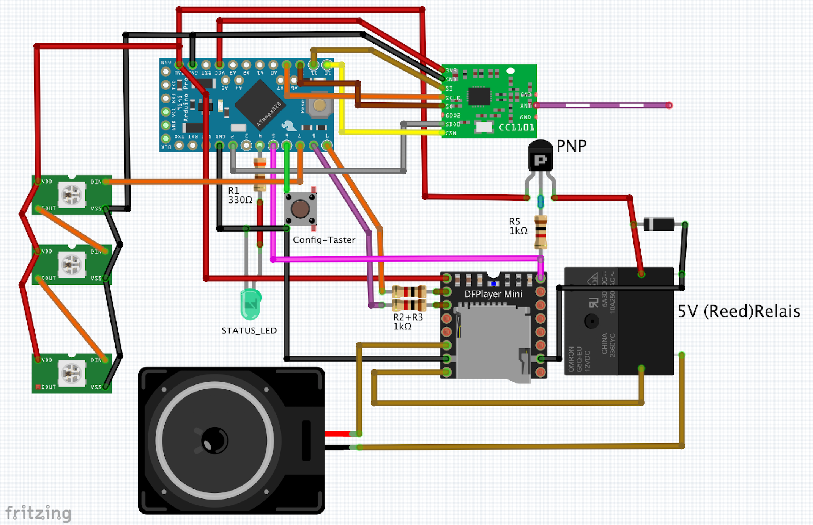

# HB-OU-MP3-LED

### netzbetriebene Lösung zur MP3-Wiedergabe und LED-Signalisierung in HomeMatic

#### :arrow_forward: erfordert [JP-HB-Devices Addon](https://github.com/jp112sdl/JP-HB-Devices-addon) Version 1.30 oder höher.

_**In eigener Sache:** Dieses Projekt ist 'wie es ist'. Es ist nach meinen persönlichen Bedürfnissen entstanden. Da es sich um ein reines Hobby-Projekt handelt, kann ich weder (umfangreichen) Support leisten, noch auf individuelle Wünsche eingehen. 
Bei Fragen/Hilfeersuchen bitte ans [HomeMatic Forum](https://homematic-forum.de/forum/viewforum.php?f=76) wenden. 
Beim Erstellen eines Beitrags unbedingt ein Foto vom Aufbau mitliefern. 
Anfragen ohne Bild und solche bei Verwendung kommerziell vertriebener Platinen, deren Schaltplan/Layout nicht offenliegt, werde ich nicht brücksichtigen. 
Bitte auch die Hinweise zum [Addon](https://github.com/jp112sdl/JP-HB-Devices-addon) beachten! - Danke_

## Teile / Schaltung

- 1x Arduino Pro Mini **3.3V / 8MHz**
- 1x CC1101 868MHz Funkmodul
- 1x DFPlayer Mini
- 16x WS2812B LEDs
- 1x Widerstand 330 Ohm
- 2x Widerstand 1k
- 1x LED (als Status-LED)
- 1x Taster
- 1x Lautsprecher (Durchmesser 55mm)

### Erweiterung zum kompletten Abschalten des Lautsprechers (falls Rauschen im Idle-Zustand zu hören ist)
- 1x Widerstand 1k
- 1x Diode (z.B. 1N4148)
- 1x PNP-Transistor (z.B. BC327)
- 1x 5V (Reed)Relais
_Der DFPlayer neigt im Ruhezustand zum Rauschen / Knistern.
Es ist daher sinnvoll, den Lautsprecher nur einzuschalten, wenn auch ein MP3 abgespielt wird:_

## Gehäuse
[Tower](https://github.com/jp112sdl/HB-OU-MP3-LED/blob/master/Images/Tower.stl)  
[Deckel](https://github.com/jp112sdl/HB-OU-MP3-LED/blob/master/Images/Deckel.stl)

## CCU
### Programm zum Abspielen eines MP3:
**Die MP3 Dateien müssen im Ordner `mp3` auf der SD Karte liegen und als Dateinamen 0001.mp3, 0002.mp3 usw. heißen.
Weitere Infos gibts auf der Seite von [DFRobot](https://www.dfrobot.com/wiki/index.php/DFPlayer_Mini_SKU:DFR0299#Copy_your_mp3_into_you_micro_SD_card).**

 

### Programm zum Ansteuern der LEDs:

